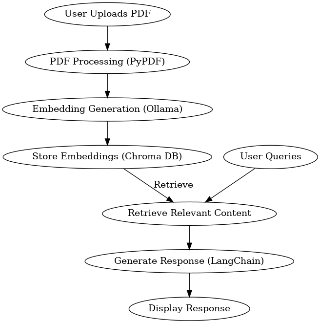
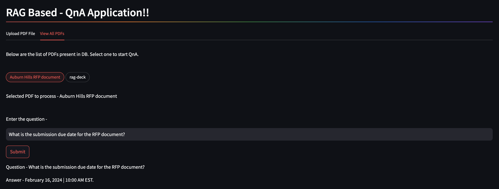
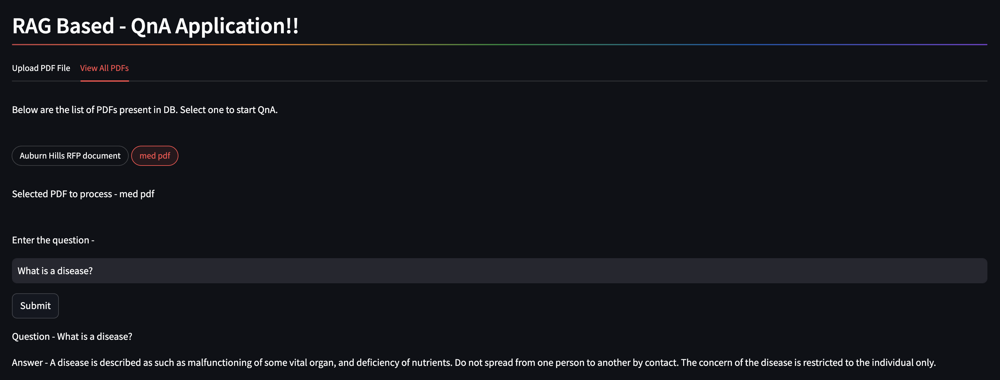
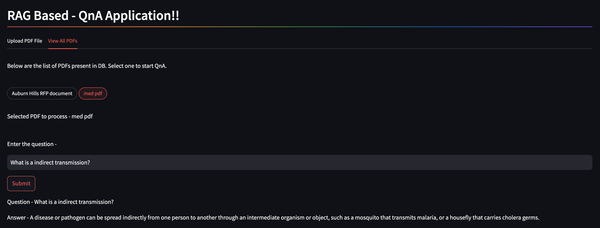

# Chat with PDF using RAG

## Overview
This project provides an AI-powered chatbot that enables users to interact with PDF documents using a Retrieval-Augmented Generation (RAG) system. It includes a FastAPI backend for managing the AI pipeline and a Streamlit frontend for a user-friendly interface.

## Features
- Upload PDF files for analysis
- Perform natural language queries on PDF content
- AI-powered conversational responses using RAG
- Fast and scalable API using FastAPI
- Seamless database management with SQLite3 for PDF details and Chroma DB for embeddings
- Support for large documents and complex queries
- Simple and interactive web interface using Streamlit

## Infrastructure Workflow
1. **PDF Upload**: Users upload PDF files via the Streamlit app with the help of the API endpoint.
2. **Preprocessing**: The content is extracted using PyPDF.
3. **Storage**: Basic PDF details are stored in an SQLite3 database, and embeddings are generated and stored using Chroma DB.
4. **AI Processing**: Using LangChain and Ollama embeddings, the RAG model generates responses.
5. **Response Generation**: The result is returned as a conversational AI response.

## Technologies Used
- FastAPI (Backend)
- Streamlit (Frontend)
- LangChain
- OpenAI
- PyPDF
- Ollama Embeddings
- Ollama LLM
- SQLite3
- Chroma DB

## Installation

### 1. Clone the Repository
```bash
git clone https://github.com/abhishekpatra8/chat_with_PDF_RAG
cd chat_with_PDF_RAG
```

### 2. Create and activate a virtual environment:
- Using Python Virtual Environment
    ```bash
    python3.11 -m venv env
    source env/bin/activate  # On Windows use `env\Scripts\activate`
    ```
-  Using Conda
    ```bash
    conda create -n chat_with_pdf_rag python=3.11
    conda activate chat_with_pdf_rag
    ```
-  Set up your `.env` file with the necessary environment variables, including your OpenAI API key and database connection.

### 3. Backend Setup (FastAPI)

- Navigate to the `backend` folder:
  ```bash
  cd backend
  ```
- Install dependencies:
  ```bash
  pip install -r requirements.txt
  ```
- Start the FastAPI server:
  ```bash
  uvicorn main:app --host 0.0.0.0 --port 8000
  ```

### 4. Frontend Setup (Streamlit)

- Navigate to the `web_app` folder:
  ```bash
  cd ../web_app
  ```
- Install dependencies using the existing virtual environment:
  ```bash
  pip install -r requirements.txt
  ```
- Run the Streamlit app:
  ```bash
  streamlit run app.py
  ```

## API Documentation

Once the FastAPI server is running, access the API documentation using the following link:
- **Swagger UI**: [http://localhost:8000/docs](http://localhost:8000/docs)

## Usage
1. Upload a PDF using the Streamlit app.
2. Ask questions about the content.
3. Receive AI-generated answers using the RAG pipeline.

## Folder Structure
```plaintext
chat_with_PDF_RAG
├── web_app
│   ├── app.py
│   ├── requirements.txt
├── backend
│   ├── main.py
│   ├── apis
│   ├── db
│   ├── models
│   ├── requirements.txt
├── sample_pdfs
│   ├── med_pdf.pdf
└── README.md
```

## Test Structure

- The test cases are located in the backend/tests directory. It includes unit tests and integration tests covering various modules:
- **Unit Tests**: Tests for individual functions and components.
- **Integration Tests**: Tests for the API endpoints and interactions between different components.

## RAG Flow Diagram


## Sample output images
- File Upload


- Sample QnA's
 

 